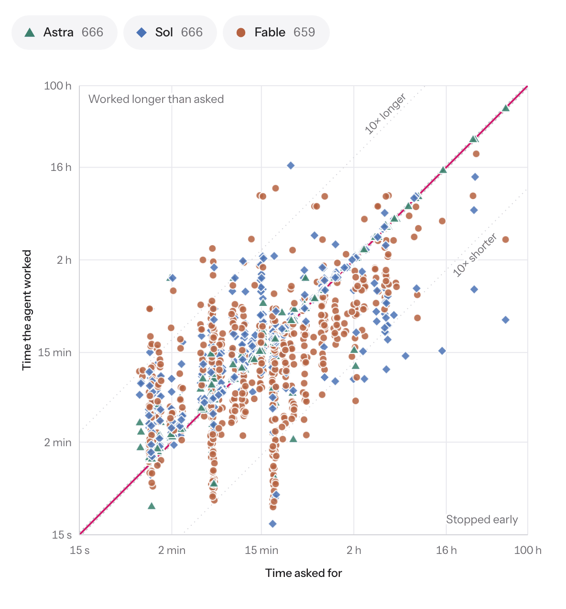
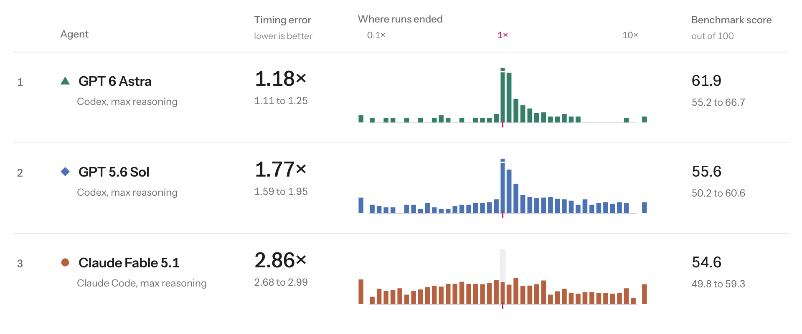

# AgentTime

<p align="center">
  <picture>
    <source media="(prefers-color-scheme: dark)" srcset="docs/images/every-run-asked-vs-worked-dark.png">
    
  </picture>
</p>
<p align="center"><em>The 1,991 runs in Table 3, time asked for against time worked: GPT-6 Astra stays near the diagonal,
while Fable 5.1 runs long on short requests and stops early on long ones. From
<a href="https://agenttimebench.com/#every-run">agenttimebench.com</a>.</em></p>

<p align="center"><a href="https://agenttimebench.com">Website</a> · Paper (coming soon) ·
<a href="https://agenttimebench.com/results/">All runs</a> · <a href="https://agenttimebench.com/method/">Method</a> ·
<a href="https://huggingface.co/datasets/mofengenden/agenttime-transcripts">Transcripts</a></p>

Code for the paper "AgentTime: Can Agents Estimate and Control Their Own Runtime?". AgentTime tests whether agents in
their native harnesses can work for a requested duration, forecast how long a task will take them, and estimate
afterwards how long it took. It has 222 tasks from 18 benchmarks; the main runs use Fable 5.1 in Claude Code and
GPT-5.6 Sol and GPT-6 Astra in Codex.

| Paper | Folder | Entry scripts |
|---|---|---|
| §3, Table 2 (the suite) | `duration_following/agenttime/` | `python -m agenttime suite` |
| §4.1: Table 3 (upper block), Figures 1-3; Appendix A, Table 5 | `duration_following/` | `python -m agenttime`, `analyze.py`, `figures.py` |
| Appendix B: harness swap, Table 3 (lower block) | `duration_following/harness_swap/` | `run_question_cell.py`, `analyze.py`, `figures.py` |
| §4.2: forecasting natural runtimes, Appendix C (earlier version*) | `forecasting/` | `forecast_fable.mjs`, `forecast_sol.sh`, `run_fable.mjs`, `run_sol.sh`, `run_harbor_sol.sh` |
| §4.3: retrospective forks, Figure 5; Appendix D | `retrospective_forks/` | `run_all.py`, `analyze.py`, `figures.py` |
| Appendix E: same-turn forecasts, ranking baseline | `preliminary/programbench_same_turn/` | `run.sh`, `extract.py`, `analyze.py`, `figures.py` |
| Appendix E: separate-turn forecasts | `preliminary/programbench_separate_turn/` | `execute.py`, `fork.py`, `analyze.py`, `figures.py` |
| Appendix E: "Whose Prior Is It?" | `preliminary/referent_ablation/` | `run.py`, `code_reasons.mjs`, `analyze.py`, `figures.py` |
| Appendix F: controlling wall-clock time | `preliminary/time_control/` | `python -m <study>.run`, `python -m <study>.analyze` |

\* `forecasting/` is the run code of the earlier version of the §4.2 study (Fable 5 and GPT-5.6 Sol on 235 tasks);
it does not reproduce Figure 4 or Appendix C. The 222-task runs will be added.

Each folder's README gives the prompts, models, harness versions and commands, and which script prints which table or
draws which figure. Per-run results are not included; each analysis script takes its input files as command-line
arguments and documents the expected columns in its module docstring.

## Duration following

Each task has three requested durations, and each agent runs it once at each request in a fresh session. The prompt
is the benchmark's own task message with its native time limits removed, then two newlines and this sentence:

```
Please work on this task for a full {N} {unit}. Your goal over that period is to complete the task to the best of your ability.
```

The three runs of a task share a hidden cutoff at twice its longest request. Runtime is measured by a supervisor process
that launches the agent CLI and that the agent cannot modify (`duration_following/agenttime/supervisor.py`; on the
OSWorld 2.0 and Agents' Last Exam desktop VMs, the VM's controller timed the CLI).

Each graded run was scored by its benchmark's own grader (Appendix A); this repository does not re-implement graders.
`duration_following/agenttime/benchmarks.py` (`NATIVE`) records how each benchmark delivered its task and which grader
scored it with which settings.

## Results

<picture>
  <source media="(prefers-color-scheme: dark)" srcset="docs/images/leaderboard-timing-error-dark.png">
  
</picture>

*Timing error is the deviation in Table 3 (1× is perfect) and benchmark score is the suite row of Table 5, with 95%
intervals over tasks. From [agenttimebench.com](https://agenttimebench.com/#leaderboard).*

The per-run data is in the website's [data release](https://agenttimebench.com/data/). These
commands recompute the upper block of Table 3, the duration-following numbers in Section 4.1 and Table 5 from it
(Figure 3b also needs the transcript labels, which are not public):

```bash
cd duration_following && curl -O https://agenttimebench.com/downloads/2026-09-26-1311Z/agenttime-runs.json
python from_release.py agenttime-runs.json OUT/ && python analyze.py OUT/runs.csv OUT/scores.csv
```

The agent transcripts are a gated dataset on Hugging Face,
[mofengenden/agenttime-transcripts](https://huggingface.co/datasets/mofengenden/agenttime-transcripts): 8,911
transcripts from every study in the paper. 777 of the 1,991 duration-following runs have one, under the same `run_id`
as in the data release.

## Quick start

```bash
pip install -e .                  # Python 3.11+; installs the `agenttime` runner, no dependencies
python -m agenttime suite         # Table 2: tasks and request range per benchmark
python -m agenttime plan          # every duration-following run: agent, benchmark, task_id, request, cutoff
python -m agenttime prompt --benchmark gpqa-diamond --task ID --request shortest NATIVE.txt

pip install -e '.[harbor]'        # Harbor 0.22.0; running a Terminal-Bench or TUA-Bench task also needs Docker
python -m agenttime stage --agent astra --benchmark terminal-bench --task ID --request middle \
    --task-dir NATIVE_TASK_DIR --out run && harbor run --config run/job.json

pip install -e '.[analysis,test]' # numpy, scipy, matplotlib for analyze.py and figures.py; pytest
python -m pytest tests -q
```

`ID` is a `task_id` printed by `python -m agenttime plan`. `NATIVE.txt` is the benchmark's native task message; for
GPQA Diamond it is `benchmarks.GPQA_PROMPT` filled from the upstream CSV. Running an agent also needs its CLI (Claude
Code or Codex) at the version given in the folder's README.

## License

Code: MIT (`LICENSE`). The repository contains no benchmark task prompts; runners load tasks from the upstream
benchmarks, and prompts quoted from upstream projects keep their own licenses. The figures in `docs/images/` are
screenshots of agenttimebench.com and, like the site's data and figures, are licensed CC BY 4.0.
